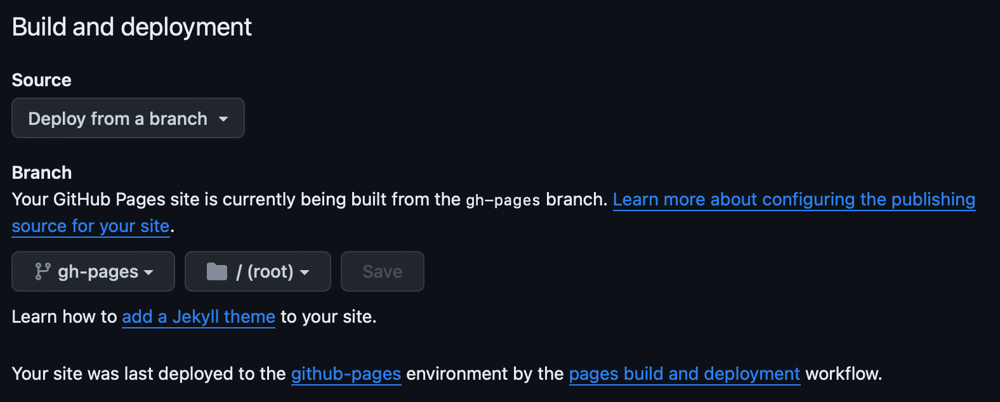

.. _host:

====================
The hosting service
====================

SCUSA, MA C'E' TRACCIA DI QUESTA MODIFICA?

What is a hosting service
-------------------------

If you followed the steps described in the :ref:`previous pages <sphinx>` of this tutorial, you should have been able to generate **HTML pages** starting from reST documents, using Sphinx.

Those HTML pages though are stored **locally** in your computer memory; you may want them to be publicly available **on the web**. That's when hosting services come into play.

A **hosting service** is what allows you to host your documentation on a server and let it be accessible publicly. 

In this tutorial you will learn how to deploy your documentation in three different platforms: :ref:`GitHub <github>`, :ref:`GitLab <gitlab>` and :ref:`Read the Docs <readthedocs>`.   

.. _github:

Exercise 1: Host your pages on GitHub
---------------------------------------

*   **Step 1**: create a ``documentation.yml`` file.

Add the path ``.github/workflows`` to your project and create a file named ``documentation.yml`` inside, with the following content:

.. code-block:: 

	name: documentation

	on: [push, pull_request, workflow_dispatch]

	permissions:
	  contents: write

	jobs:
	  docs:
	    runs-on: ubuntu-latest
	    steps:
	      - uses: actions/checkout@v3
	      - uses: actions/setup-python@v3
	      - name: Install dependencies
	        run: |
	          pip install sphinx sphinx_rtd_theme myst_parser
	      - name: Sphinx build
	        run: |
	          sphinx-build source build
	      - name: Deploy to GitHub Pages
	        uses: peaceiris/actions-gh-pages@v3
	        if: ${{ github.event_name == 'push' && github.ref == 'refs/heads/main' }}
	        with:
	          publish_branch: gh-pages
	          github_token: ${{ secrets.GITHUB_TOKEN }}
	          publish_dir: build/
	          force_orphan: true
			  
			 
The important line is the one that contains the ``sphinx-build`` instruction. The syntax of this instruction is

.. code-block:: bash

	sphinx-build <sourcedir> <outputdir> 
	
and in our example the source directory is called ``source`` while the output directory is called ``build``. The names of the source and output directory may be different, so make sure that the file contains the correct references to these directories.

*	**Step 2**: configure GitHub Pages.

Once you add this file to your project repository and push it on GitHub, a **new branch** called ``gh-pages`` will be created.

On GitHub, you then have to go to **Settings > Pages**, select **"deploy from a branch"** under the section **"Build and deployment"**, select the branch ``gh-pages`` and save changes.

   
   Go to "Settings" on the upper toolbar

.. figure:: ./pages.png
   :scale: 50 
   
   Go to "Pages" on the left sidebar
   
   

   Select "deploy from a branch" and "gh-pages"

The **deployment** of the documentation will start automatically and you can acces your website by navigating to **Actions > Deployments**.

*	**Step 3**: push changes to your GitHub repository.

GitHub Pages will deploy your documentation **every time you push** changes on your repository.

.. _gitlab:

Exercise 2: Host your pages on GitLab
---------------------------------------

Crea repository su gitlab

Crea un file ``.gitlab-ci.yml`` con il seguente contenuto:

.. code-block::

	image: python:3.7-alpine

	test:
	  stage: test
	  script:
	  - pip install -U sphinx
	  - sphinx-build -b html . public
	  rules:
	    - if: $CI_COMMIT_REF_NAME != $CI_DEFAULT_BRANCH
    
	pages:
	  stage: deploy
	  script:
	  - pip install -U sphinx
	  - sphinx-build -b html . public
	  artifacts:
	    paths:
	    - public
	  rules:
	    - if: $CI_COMMIT_REF_NAME == $CI_DEFAULT_BRANCH

Attenzione alla riga - sphinx-build -b html . public, modificarla ad hoc

Il deploy della pagina parte

Visitare il proprio sito su Pages

Se modifichi il path del progetto con username.gitlab.io, (attenzione: modificare config della cartella locale) allora puoi visitare il sito su https://username.gitlab,io

.. _readthedocs:

Exercise 3: Host your pages on Read the Docs
--------------------------------------------

*   **Step 1**: sign up on Read the Docs with GitHub. 

Sign up on `Read the Docs <https://readthedocs.com>`_  with your **GitHub** account. Read the docs will now have acces to your repositories on GitHub.

*   **Step 2**: add a configuration file.

Add a ``.readthedocs.yaml`` file in your project's repository with the following content:

.. code-block:: 

	# .readthedocs.yaml
	# Read the Docs configuration file
	# See https://docs.readthedocs.io/en/stable/config-file/v2.html for details

	# Required
	version: 2

	# Set the OS, Python version and other tools you might need
	build:
	  os: ubuntu-22.04
	  tools:
	    python: "3.12"
	    # You can also specify other tool versions:
	    # nodejs: "19"
	    # rust: "1.64"
	    # golang: "1.19"

	# Build documentation in the "docs/" directory with Sphinx
	sphinx:
	  configuration: source/conf.py

	# Optionally build your docs in additional formats such as PDF and ePub
	# formats:
	#    - pdf
	#    - epub

	# Optional but recommended, declare the Python requirements required
	# to build your documentation
	# See https://docs.readthedocs.io/en/stable/guides/reproducible-builds.html
	# python:
	#    install:
	#    - requirements: docs/requirements.txt

Notice that Read the Docs wants to know the path to the ``conf.py`` document: make sure the path to this file is correct.

*	**Step 3**: push changes to your GitHub repository.

**Read the Docs** will deploy your documentation **every time you push** changes on your GitHub repository.